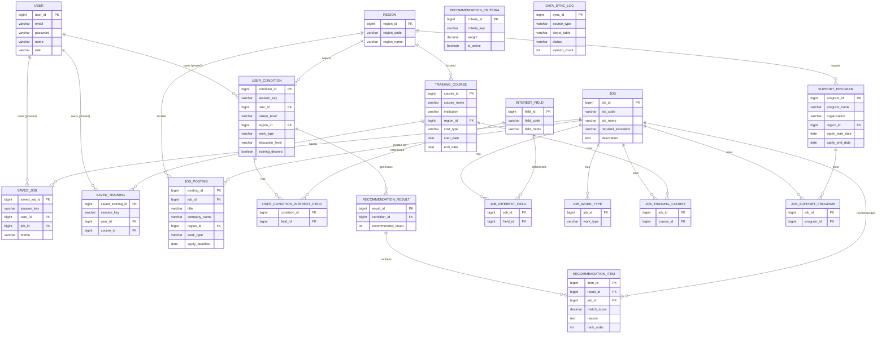

# 취업 정보 추천·탐색 서비스 — ERD 설계

> 대상 범위: 초기 기획서 5개 핵심 기능 전체
> 1) 사용자 조건 입력 · 2) 직업/고용 정보 추천 · 3) 공공데이터 기반 정보 탐색 · 4) 결과 저장/비교 · 5) 관리자/데이터 관리

## 0. 설계 전제

- **비로그인 사용 지원(MVP)**: 회원가입은 2단계 항목이므로, 사용자 데이터(조건 입력·저장)는 `session_key`(프론트에서 발급하는 UUID)로 식별한다. `user_id`는 NULL 허용 FK로 미리 열어두어 2단계 로그인 연동 시 스키마 변경 없이 매핑만 추가한다.
- **관리자 기능은 별도 로그인 필요**: `user.role` 컬럼(`USER`/`ADMIN`)으로 구분한다.
- **Enum은 전부 `VARCHAR` + 상수 문자열**로 관리(DB 전환 가능성 고려). JPA에서는 `@Enumerated(EnumType.STRING)` + `@Column(columnDefinition = "VARCHAR(20)")` 패턴 유지.
- **지역/근무형태/학력/경력 등 반복 사용되는 코드값**은 여러 테이블에서 조인 일관성을 위해 `region`만 마스터 테이블로 두고, 나머지는 Enum(VARCHAR)로 관리한다.
- DDL은 수동 관리(`ddl-auto: validate`) 기준. Entity → Repository → DTO → Service → Controller 순서로 구현.

## 1. 엔티티 목록

| 구분 | 테이블 | 설명 | 대응 기능 |
|---|---|---|---|
| 사용자 | `user` | 회원 계정(2단계 대비) + 관리자 role | - |
| 사용자 | `user_condition` | 사용자 조건 입력 | 1 |
| 사용자 | `user_condition_interest_field` | 조건 ↔ 관심분야 매핑(복수 선택) | 1 |
| 마스터 | `region` | 지역 코드 마스터 | 1, 3 |
| 마스터 | `interest_field` | 관심 분야 마스터 | 1, 2 |
| 마스터 | `job` | 직업 정보 | 2, 3 |
| 마스터 | `job_interest_field` | 직업 ↔ 관심분야 매핑 | 2 |
| 마스터 | `job_work_type` | 직업 ↔ 근무형태 매핑 | 2 |
| 마스터 | `training_course` | 직업훈련 과정 | 2, 3 |
| 마스터 | `support_program` | 고용지원제도 | 2, 3 |
| 마스터 | `job_posting` | 지역별 일자리 정보 | 3 |
| 매핑 | `job_training_course` | 직업 ↔ 훈련 연결 | 2 |
| 매핑 | `job_support_program` | 직업 ↔ 지원제도 연결 | 2 |
| 추천 | `recommendation_result` | 추천 결과 헤더 | 2 |
| 추천 | `recommendation_item` | 추천 직업 + 추천 이유 + 점수 | 2 |
| 저장 | `saved_job` | 관심 직업 저장 | 4 |
| 저장 | `saved_training` | 관심 훈련 과정 저장 | 4 |
| 관리 | `recommendation_criteria` | 추천 기준(가중치) 관리 | 5 |
| 관리 | `data_sync_log` | 공공데이터 수집/갱신 이력 | 5 |

> **추천 결과 비교**(4번)는 별도 테이블 없이, 저장된 직업(`saved_job`) 또는 전달받은 `jobId` 목록을 조회 시점에 나란히 가공해서 응답한다.

## 2. ERD 다이어그램



## 3. 테이블 상세 명세

### 3-1. 사용자 / 조건 입력

**`user`** — 회원 계정 (2단계 대비, 관리자 role 포함)

| 컬럼 | 타입 | 제약조건 | 설명 |
|---|---|---|---|
| user_id | BIGINT | PK, AUTO_INCREMENT | |
| email | VARCHAR(100) | UNIQUE, NOT NULL | |
| password | VARCHAR(255) | NOT NULL | 암호화 저장 |
| name | VARCHAR(50) | NOT NULL | |
| role | VARCHAR(20) | NOT NULL, DEFAULT 'USER' | `USER` / `ADMIN` |
| created_at | DATETIME | NOT NULL | |
| updated_at | DATETIME | NOT NULL | |

> MVP 단계에서는 일반 사용자용 로그인은 미구현(세션 기반). 단, 관리자 기능(5번)을 위해 `role='ADMIN'` 계정 로그인은 MVP에도 최소 구현한다.

**`user_condition`** — 사용자 조건 입력

| 컬럼 | 타입 | 제약조건 | 설명 |
|---|---|---|---|
| condition_id | BIGINT | PK, AUTO_INCREMENT | |
| session_key | VARCHAR(64) | NOT NULL, INDEX | 비로그인 사용자 식별용 UUID |
| user_id | BIGINT | FK → user, NULL | 2단계 로그인 연동 전까지 NULL |
| career_level | VARCHAR(20) | NOT NULL | 경력 수준 `NEW`/`JUNIOR`/`MID`/`SENIOR` |
| region_id | BIGINT | FK → region, NULL | 거주 지역 |
| work_type | VARCHAR(20) | NULL | 희망 근무 형태 |
| education_level | VARCHAR(20) | NOT NULL | 학력 |
| training_desired | BOOLEAN | NOT NULL, DEFAULT false | 훈련 희망 여부 |
| created_at | DATETIME | NOT NULL | |

**`user_condition_interest_field`** — 조건 ↔ 관심분야 (N:M)

| 컬럼 | 타입 | 제약조건 | 설명 |
|---|---|---|---|
| condition_id | BIGINT | FK → user_condition, PK(복합) | |
| field_id | BIGINT | FK → interest_field, PK(복합) | |

### 3-2. 마스터 데이터

**`region`** — 지역 코드 마스터

| 컬럼 | 타입 | 제약조건 | 설명 |
|---|---|---|---|
| region_id | BIGINT | PK, AUTO_INCREMENT | |
| region_code | VARCHAR(20) | UNIQUE, NOT NULL | `SEOUL`/`BUSAN`/`GYEONGGI`/... |
| region_name | VARCHAR(50) | NOT NULL | 서울특별시 등 |

**`interest_field`** — 관심 분야 마스터

| 컬럼 | 타입 | 제약조건 | 설명 |
|---|---|---|---|
| field_id | BIGINT | PK, AUTO_INCREMENT | |
| field_code | VARCHAR(30) | UNIQUE, NOT NULL | `IT`/`MARKETING`/`DESIGN`/`HR`/`MANUFACTURING`/`HEALTHCARE`/... |
| field_name | VARCHAR(50) | NOT NULL | |

**`job`** — 직업 정보

| 컬럼 | 타입 | 제약조건 | 설명 |
|---|---|---|---|
| job_id | BIGINT | PK, AUTO_INCREMENT | |
| job_code | VARCHAR(30) | UNIQUE, NOT NULL | |
| job_name | VARCHAR(50) | NOT NULL | |
| required_education | VARCHAR(20) | NULL | 일반적 요구 학력(추천 매칭용) |
| avg_salary_text | VARCHAR(100) | NULL | "신입 연 3,000만원~" 등 |
| description | TEXT | NULL | 직업 상세 설명 |
| source | VARCHAR(30) | NULL | 데이터 출처(워크넷 등) |
| created_at | DATETIME | NOT NULL | |
| updated_at | DATETIME | NOT NULL | |

**`job_interest_field`** — 직업 ↔ 관심분야 (N:M)

| 컬럼 | 타입 | 제약조건 | 설명 |
|---|---|---|---|
| job_id | BIGINT | FK → job, PK(복합) | |
| field_id | BIGINT | FK → interest_field, PK(복합) | |

**`job_work_type`** — 직업 ↔ 근무형태 (N:M, 추천 매칭용)

| 컬럼 | 타입 | 제약조건 | 설명 |
|---|---|---|---|
| job_id | BIGINT | FK → job, PK(복합) | |
| work_type | VARCHAR(20) | PK(복합) | `FULL_TIME`/`PART_TIME`/`CONTRACT`/`INTERN`/`REMOTE` |

**`training_course`** — 직업훈련 과정

| 컬럼 | 타입 | 제약조건 | 설명 |
|---|---|---|---|
| course_id | BIGINT | PK, AUTO_INCREMENT | |
| course_name | VARCHAR(200) | NOT NULL | |
| institution | VARCHAR(100) | NULL | 훈련기관 |
| region_id | BIGINT | FK → region, NULL | |
| cost_type | VARCHAR(20) | NULL | `FREE`/`PAID`/`GOV_SUPPORTED` |
| start_date | DATE | NULL | |
| end_date | DATE | NULL | |
| description | TEXT | NULL | |
| external_url | VARCHAR(500) | NULL | |
| source | VARCHAR(30) | NULL | HRD-Net 등 |
| created_at | DATETIME | NOT NULL | |
| updated_at | DATETIME | NOT NULL | |

**`support_program`** — 고용지원제도

| 컬럼 | 타입 | 제약조건 | 설명 |
|---|---|---|---|
| program_id | BIGINT | PK, AUTO_INCREMENT | |
| program_name | VARCHAR(200) | NOT NULL | |
| organization | VARCHAR(100) | NULL | 주관 기관 |
| target_audience | VARCHAR(200) | NULL | 지원 대상 |
| support_content | TEXT | NULL | 지원 내용 |
| region_id | BIGINT | FK → region, NULL | NULL = 전국 |
| apply_start_date | DATE | NULL | |
| apply_end_date | DATE | NULL | |
| external_url | VARCHAR(500) | NULL | |
| source | VARCHAR(30) | NULL | |
| created_at | DATETIME | NOT NULL | |
| updated_at | DATETIME | NOT NULL | |

**`job_posting`** — 지역별 일자리 정보

| 컬럼 | 타입 | 제약조건 | 설명 |
|---|---|---|---|
| posting_id | BIGINT | PK, AUTO_INCREMENT | |
| job_id | BIGINT | FK → job, NULL | 공공데이터 매핑 안 될 수 있어 NULL 허용 |
| title | VARCHAR(200) | NOT NULL | 채용 공고명 |
| company_name | VARCHAR(100) | NULL | |
| region_id | BIGINT | FK → region, NULL | |
| work_type | VARCHAR(20) | NULL | |
| required_education | VARCHAR(20) | NULL | |
| career_level | VARCHAR(20) | NULL | |
| salary_text | VARCHAR(100) | NULL | |
| apply_deadline | DATE | NULL | |
| external_url | VARCHAR(500) | NULL | |
| source | VARCHAR(30) | NULL | |
| created_at | DATETIME | NOT NULL | |
| updated_at | DATETIME | NOT NULL | |

**`job_training_course`** — 직업 ↔ 훈련 (N:M)

| 컬럼 | 타입 | 제약조건 | 설명 |
|---|---|---|---|
| job_id | BIGINT | FK → job, PK(복합) | |
| course_id | BIGINT | FK → training_course, PK(복합) | |

**`job_support_program`** — 직업 ↔ 지원제도 (N:M)

| 컬럼 | 타입 | 제약조건 | 설명 |
|---|---|---|---|
| job_id | BIGINT | FK → job, PK(복합) | |
| program_id | BIGINT | FK → support_program, PK(복합) | |

### 3-3. 추천

**`recommendation_result`** — 추천 결과 헤더

| 컬럼 | 타입 | 제약조건 | 설명 |
|---|---|---|---|
| result_id | BIGINT | PK, AUTO_INCREMENT | |
| condition_id | BIGINT | FK → user_condition, NOT NULL | |
| recommended_count | INT | NOT NULL | 추천 직업 수 |
| created_at | DATETIME | NOT NULL | |

**`recommendation_item`** — 추천 직업 + 추천 이유

| 컬럼 | 타입 | 제약조건 | 설명 |
|---|---|---|---|
| item_id | BIGINT | PK, AUTO_INCREMENT | |
| result_id | BIGINT | FK → recommendation_result, NOT NULL | |
| job_id | BIGINT | FK → job, NOT NULL | 추천된 직업 |
| match_score | DECIMAL(5,2) | NOT NULL | 조건 매칭 점수 |
| reason | TEXT | NULL | 추천 이유(어떤 기준이 매칭됐는지 문장) |
| rank_order | INT | NOT NULL | 노출 순위 |

### 3-4. 저장

**`saved_job`** — 관심 직업 저장

| 컬럼 | 타입 | 제약조건 | 설명 |
|---|---|---|---|
| saved_job_id | BIGINT | PK, AUTO_INCREMENT | |
| session_key | VARCHAR(64) | NOT NULL, INDEX | |
| user_id | BIGINT | FK → user, NULL | |
| job_id | BIGINT | FK → job, NOT NULL | |
| memo | VARCHAR(255) | NULL | |
| created_at | DATETIME | NOT NULL | |
| | | UNIQUE(session_key, job_id) | 중복 저장 방지 |

**`saved_training`** — 관심 훈련 과정 저장

| 컬럼 | 타입 | 제약조건 | 설명 |
|---|---|---|---|
| saved_training_id | BIGINT | PK, AUTO_INCREMENT | |
| session_key | VARCHAR(64) | NOT NULL, INDEX | |
| user_id | BIGINT | FK → user, NULL | |
| course_id | BIGINT | FK → training_course, NOT NULL | |
| created_at | DATETIME | NOT NULL | |
| | | UNIQUE(session_key, course_id) | 중복 저장 방지 |

### 3-5. 관리자 / 데이터 관리

**`recommendation_criteria`** — 추천 기준(가중치) 관리

| 컬럼 | 타입 | 제약조건 | 설명 |
|---|---|---|---|
| criteria_id | BIGINT | PK, AUTO_INCREMENT | |
| criteria_key | VARCHAR(30) | UNIQUE, NOT NULL | `INTEREST_FIELD_MATCH`/`WORK_TYPE_MATCH`/`EDUCATION_MATCH`/`CAREER_MATCH`/`REGION_MATCH` |
| weight | DECIMAL(5,2) | NOT NULL | 매칭 시 가산 점수 |
| is_active | BOOLEAN | NOT NULL, DEFAULT true | |
| description | VARCHAR(255) | NULL | |
| updated_at | DATETIME | NOT NULL | |

**`data_sync_log`** — 공공데이터 수집/갱신 이력

| 컬럼 | 타입 | 제약조건 | 설명 |
|---|---|---|---|
| sync_id | BIGINT | PK, AUTO_INCREMENT | |
| source_type | VARCHAR(30) | NOT NULL | `WORKNET`/`HRD_NET`/`K_STARTUP`/... |
| target_table | VARCHAR(50) | NOT NULL | 갱신 대상 테이블명 |
| status | VARCHAR(20) | NOT NULL | `SUCCESS`/`FAILED`/`RUNNING` |
| synced_count | INT | NULL | 처리 건수 |
| message | TEXT | NULL | 결과/오류 메시지 |
| started_at | DATETIME | NOT NULL | |
| finished_at | DATETIME | NULL | |

## 4. Enum(VARCHAR) 코드값 정의

| 도메인 | 컬럼 | 값 |
|---|---|---|
| 경력 수준 | `career_level` | `NEW`(신입) / `JUNIOR` / `MID` / `SENIOR` |
| 학력 | `education_level`, `required_education` | `HIGH_SCHOOL` / `ASSOCIATE` / `BACHELOR` / `MASTER` / `DOCTORATE` / `ANY` |
| 근무 형태 | `work_type` | `FULL_TIME` / `PART_TIME` / `CONTRACT` / `INTERN` / `REMOTE` |
| 훈련 비용 | `cost_type` | `FREE` / `PAID` / `GOV_SUPPORTED` |
| 사용자 역할 | `role` | `USER` / `ADMIN` |
| 추천 기준 | `criteria_key` | `INTEREST_FIELD_MATCH` / `WORK_TYPE_MATCH` / `EDUCATION_MATCH` / `CAREER_MATCH` / `REGION_MATCH` |
| 동기화 상태 | `status` | `SUCCESS` / `FAILED` / `RUNNING` |

## 5. 추천 로직 개요

`recommendation_criteria`의 활성 가중치를 읽어, 각 직업(`job`)에 대해 사용자 조건과 매칭되는 항목마다 점수를 가산한다.

```
match_score(job) =
    (관심분야 일치 → INTEREST_FIELD_MATCH weight)
  + (근무형태 일치 → WORK_TYPE_MATCH weight)
  + (학력 충족   → EDUCATION_MATCH weight)
  + (경력 적합   → CAREER_MATCH weight)
  + (해당 지역 일자리 존재 → REGION_MATCH weight)
```

- 점수 상위 N개를 `recommendation_item`에 저장하고, `reason`에는 매칭된 기준을 문장으로 조합(예: "관심분야(IT)와 희망 근무형태(정규직)가 일치합니다").
- 각 추천 직업의 상세에서 `job_training_course`, `job_support_program`을 통해 관련 훈련·지원제도를 연결해 응답한다.

## 6. PostgreSQL 타입 매핑

이 문서의 타입 표기는 DB 중립적인 표기다. 실제 `sql/schema.sql`(PostgreSQL) 작성 시 아래 규칙으로 변환한다.

| 이 문서의 표기 | PostgreSQL 실제 타입 | 비고 |
|---|---|---|
| `BIGINT PK, AUTO_INCREMENT` | `BIGINT GENERATED ALWAYS AS IDENTITY PRIMARY KEY` | |
| `VARCHAR(n)` | `VARCHAR(n)` | 동일 |
| `TEXT` | `TEXT` | 동일 |
| `DATETIME` | `TIMESTAMP` | |
| `DATE` | `DATE` | 동일 |
| `BOOLEAN` | `BOOLEAN` | 동일 |
| `DECIMAL(p,s)` | `NUMERIC(p,s)` | |
| `FK → table` | `REFERENCES table(pk_column)` | |

예시 (`region` 테이블):
```sql
CREATE TABLE region (
    region_id   BIGINT GENERATED ALWAYS AS IDENTITY PRIMARY KEY,
    region_code VARCHAR(20) NOT NULL UNIQUE,
    region_name VARCHAR(50) NOT NULL
);
```
